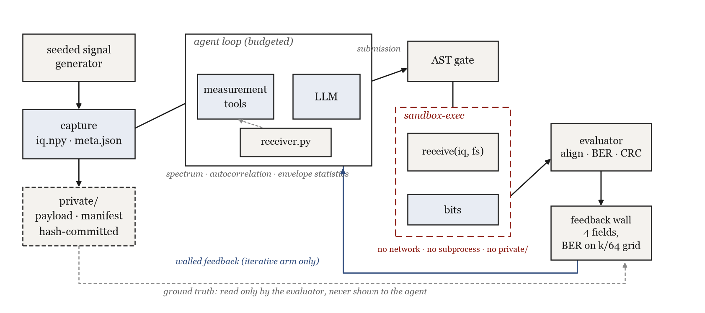
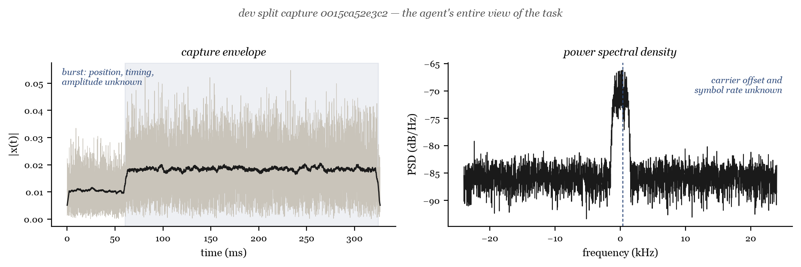
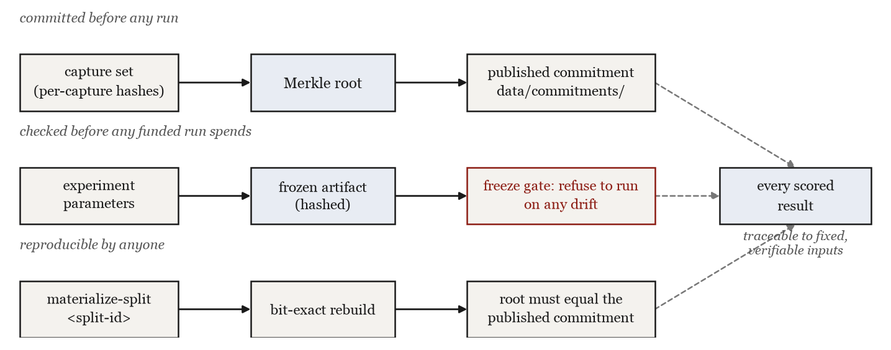
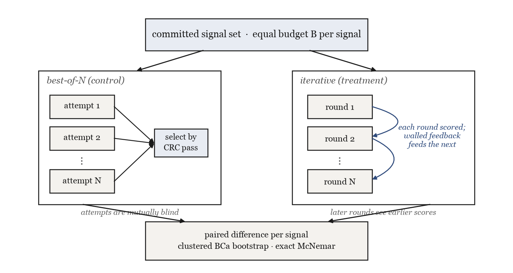

# modem-bench

Modem bench is a physical-layer benchmark for LLM agents. Each task is the raw IQ recording of a radio
burst with unknown symbol rate, carrier offset, framing and SNR. The agent has to write a
Python receiver that recovers the transmitted packet, and gets scored bit-exactly against a
hash-committed payload.



## The task

Each capture is a BPSK burst in noise. Symbol rate, carrier offset, phase, timing,
amplitude, burst position and SNR are all randomized, with SNR drawn close to the
theoretical limit for uncoded links. The agent can only inspect the signal through a small
set of characterized measurement tools (spectrum, autocorrelation, envelope statistics).
It submits a `receive(iq, sample_rate)` function; the returned bits are aligned against the
hidden ground truth and success means zero bit errors with a passing CRC. Estimating the
symbol rate blind is part of the task, same as in any non-cooperative receiver.



## Validation ('anti cheat')

The agent's code runs on the same machine that stores the answers, so measures are in place
to ensure that the comparison is fair and agent did not have access to undesired data:

* a macOS `sandbox-exec` kernel profile denies network access, subprocesses, and all file
  access outside a scratch directory, including the `private/` truth tree
* a static AST gate rejects escape idioms (`open`, `eval`, introspection, NumPy IO) before
  execution
* scoring feedback is restricted to 4 fields, and the bit-error rate is quantized onto a
  dyadic grid, since the exact rational value would leak the hidden payload length through
  its continued-fraction expansion
* test sets are Merkle-committed before any run, splits rebuild bit-exactly from published
  commitments (`modembench materialize-split <split-id>`), and experiment parameters are
  frozen in a hash-verified artifact that funded runs re-check before spending



## The experiment

**Does seeing the score and repairing beat blind resampling at the
same compute budget?** Two budget-matched arms run over the same committed signals,
best-of-N (N independent attempts with CRC-based selection) versus an N-round repair loop
that sees the restricted feedback. Analysis is a signal-clustered BCa bootstrap on the
paired difference plus an exact McNemar check, with the decision threshold fixed in
advance. The comparison campaign is still running; results will be published together with
the analysis records.



## Quickstart

```
python3 -m venv .venv
./.venv/bin/python -m pip install -e .
./.venv/bin/python -m modembench materialize-split fae1119f323962de5a0f9b2eb3c58ab22c1929c30d633486cc7de5083e084991
./.venv/bin/python -m modembench materialize-split 750cadc6f76e150d4ef2c8b9432dcf8bebfb187f3fd798749d315a6bf782fd87
```

Requires Python 3.14 and macOS since the sandbox profile is `sandbox-exec` specific (can be made compatible with other OS's by changing just this component).

To watch one scored run end to end:

```
./.venv/bin/python -m modembench arm-run --arm best-of-n --split dev \
    --captures-root captures/dev-frozen-v1 --unfunded-n 2 --limit 1 \
    --out /tmp/demo-run
```

## Docs

[docs/project-overview.md](docs/project-overview.md) is the entry point and links every
module. Sandbox details are in
[docs/sandbox-architecture.md](docs/sandbox-architecture.md), and the choice of difficulty
settings has been determined based on real receivers and standards in
[docs/industry-anchoring.md](docs/industry-anchoring.md) (but feel free to play with this).
